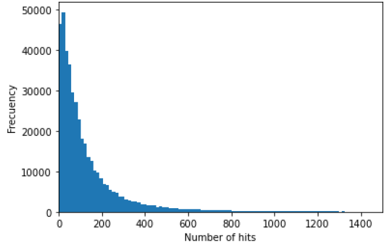

```{r setup, include=FALSE}
knitr::opts_chunk$set(echo = FALSE)

# Load dependencies 
library(reticulate) # For rendering Python code 
```

## Abstract 

This blogpost focuses on the prediction of hits on apartment listings on the online platform Immobilienscout24. For this purpose, we are using an extensive dataset covering cross-sectional information on over 400,000 apartment advertisements in Germany, generated by the Forschungsdatenzentrum Ruhr. Since the dataset contains both information on the respective apartments as well as the meta-information of user clicks on the advertisements, we are enabled to use apartment characteristics to predict the number of clicks on advertisements. For the predictions, we are using several distinct machine learning algorithms: (linear) regression models as a first baseline as well as more advanced tree models, support vector machine, multilayer perceptron, and ensemble learning. The main goal of this project was two-fold: On the one hand, specifying several models with increasing complexity were expected to increase the overall click prediction accuracy. On the other hand, this project served as getting first hands-on experience with different machine learning models. As a main result, we find that while the more advanced models effectively increase the prediction accuracy, the runtime of these models is significantly higher. 

## Introduction / Background

Predicting the number of clicks on advertisements on the internet is a common task in recent machine learning applications: Exemplarily, previous work has focused on predicting what determines advertisement’s success on Facebook [@he2014practical] or the Microsoft search engine [@richardson2007predicting]. In this project, we are applying similar frameworks to the domain of housing listings on the German housing portal Immobilienscout24, using several characteristics of the respective ads for predicting how often user have clicked on it

The introduction explains the problem, why it's difficult, interesting, or important, how and why current methods succeed/fail at the problem, and explains the key ideas of your approach and results. Though an introduction covers similar material as an abstract, the introduction gives more space for motivation, detail, references to existing work, and to capture the reader's interest.

## Related Work 

As already introduced, predicting clicks on advertisements or related webpages is not an inherently new task and has been applied in machine learning frameworks in the past. He and co-authors explored what user characteristics determine the clicks of advertisements on Facebook[@he2014practical]. Fur this purpose, they do not measure the absolute number of clicks as in our application, but rather the click through rate (CTR) of the advertisements. The CTR displays a value that is calculated by dividing the “successful” clicks by the total number of views of the advertisements. Concretely, a click-through rate of 10 per cent would indicate that 10 per cent of user who see an advertisement actually end up clicking on it. Subsequently, the click-through rate can be interpreted as a measure of success for online advertisements.

In the context of Facebook advertisements, the authors find that a combination of a logistic regression model combined with a decision tree model works best for the predictions, outperforming the models applied on their own. Although the dependent variable slightly differs from the specification of our dependent variable, this study still provides the important implication that combining distinct models might improve the quality of our predictions.

The prediction of clicks has also been applied in further research regarding the success of advertisements on the Microsoft search engine [@richardson2007predicting]. Again, the authors predict the CTR for new advertisements, additionally considering the position of the respective advertisement. This conditioning on the position of the advertisement on the search output is due to the reasonable assumption that advertisements that are positioned comparatively high (among the first search results) are significantly more often viewed. Again, the authors are facing a regression task, and are using logistic regression for predicting the CTR. 

All papers discussed here use some kind of logistic regression models, which is well-reasoned since the CTR usually is a value between 0 and 1 and can be interpreted as a probability. Since we are rather dealing with count data as output variable, we need to slightly adapt our (baseline) regression models for taking the special characteristics of count data into consideration. However, regarding the general model specification, the previous literature discussed here implies that it might be a reasonable approach to specify a comparatively simple (linear) regression model as a first baseline model and use a combination of that baseline model with more sophisticated frameworks for improving the performance. Therefore, the previous literature has provided some useful connections to our work. In the next section, we discuss the models that were used for predicting the number of clicks on Immobilienscout24 listings.

## Data 

**Dataset**: To achieve our objectives, and given the fact that several sources are available, we decided to analyze online ads for the German real estate market. Our search for a relevant data set led us to the RWI-GEO-RED dataset, which has been curated by the FDZ Ruhr am RWI and is documented in Breidenbach and Schaffner (2020)[@breidenbach2020real]. The dataset contains a host of variables describing residential real estate listings from ImmobilienScout24, considered the largest online platform for real estate offers in Germany. These variables describe not only the property being listed but also include metadata that describe the ad itself. the ad itself (e.g. days of availability, number of hits, etc.). The complete dataset includes variables that are sensitive from a privacy point of view and are not available to the general public. Moreover, most of its variables have a sample size of over 19 million. For these reasons, the FDZ Ruhr at RWI has curated a smaller dataset that does not contain sensitive information and can thus be used for teaching purposes, which they call the campus dataset. This is the dataset to which we requested access.

The campus dataset includes cross-sectional and panel data for four types of advertisements: houses for sale, houses for rent, flats for sale, and flats for rent. We decided to use the cross-sectional data, as it is better suited for our objectives and chose to work with flats for rent, as we believe it is the most dynamic and interesting type of property. The file contains more than 400 thousand observations of 57 variables. However, not all were properly suited for the task at hand and we conducted a dataset curation process.

**The curation process** The first step in our pipeline was, as expected, to curate our own version of the "raw" RWI-GEO-RED dataset. Many variables had specific codes for different kinds of missing values and error codes. In total, the raw data contained seven different codes for missing values, as specified in Schaffner (2020)\cite{beschreibung}. In order to homogenize the dataset, we first had to make sure all these values were recoded into *NaN*. In order to recode, as was the case with several tasks in our pipeline with the objective of practicing our Python skills and gain first-hand experience, we decided to "manually" set all these cases to *NaN* rather than invoke some ready-made function. We used method *replace* from module *pandas* to achieve this. 

With our variables recoded, we were now in a position to conduct a basic analysis of the features in the dataset to determine their usability for the regression task of our target variable *hits*. Our first analysis sought to assess the number of *NaN* in each variable. Once this was achieved, we decided to keep all variables with a zero *NaN* count, which reduced the number of variables in the dataset to twenty two. Two other relevant variables with comparatively low *NaN* counts were salvaged by uniformly imputing values, meaning we assigned the same value throughout. The number of rooms and utilities were imputed their corresponding mode and mean, respectively. This strategy was chosen because whereas the number of rooms has to be an integer, the cost of utilities can take a real value. We decided to drop other variables with relatively high *NaN* counts, as some experimentation with other more sophisticated imputation strategies resulted in variables that seemed to contain information we deemed too artificial.

Other irrelevant (high level geographical information) or redundant variables (such as property type, which is uniform throughout the dataset) and metadata (like information quantifying ad metrics) were also dropped, leaving us with fifteen features to work with in our models. The features contained in our model is summarized in table 1. 

```{r tab1, eval = TRUE, echo = FALSE, out.width = '100%'}
knitr::include_graphics("figures/table1.png")
```


## Proposed Method 

### Preprocessing

In preparation to fitting our models, we conducted two kinds of preprocessing: one-hot encoding and scaling. 

We one-hot-encoded variable adat, which contains information about the time of the year when the ad was published, the only categorical variable in the dataset. The format of the values this variable takes follows a pattern that would allow us to parse it and obtain each posting's month and year of publication. The component corresponding to the posting's month of publication could possibly contain information regarding the seasonality of the posting. However, after exploring some options to encode these cyclical feature, we decided to one-hot encode it to focus our energy in the models. This, in addition to keeping the predictive value of the year component of this variable, is a potential improvement for future iterations of the project. 

The next step was perhaps one of the most impactful of our project and one from which we draw one of the most important conclusions. Our previous experiments with a multi-layer perceptron regressor yielded not only prohibitive training times but also dangerous processor temperatures (see figure 3). As is shown in the figure, the processors cooling mechanism (fan) was activated. This is far from being only anecdotal. According to Intel, the manufacturer of the CPU used to run our models, the temperature monitored is very similar to the measurement corresponding to the junction temperature of the processor, which has a chip-specific maximum operating value. At this temperature, the physical integrity of the unit is at risk, hence triggering a protection mechanism that will attempt to forcibly cool down the processor, in this case the computer's fan.

```{r fig1, eval = TRUE, echo = FALSE, out.width = '100%', fig.cap = "Fan temperature"}
knitr::include_graphics("figures/temp.png")
```

As a mitigation measure, we deployed our pipeline on the Hertie's server, which allowed us to prevent our non-specialized hardware from being overworked. However, we were surprised by similar performance metrics. 

In order to overcome this we looked into possible causes and realized we had overlooked a very important and standard preprocesssing step that is very standard and discussed in papers like LeCun et al. [@LeCun2012]: feature scaling. Since we don’t know the distribution of the features and the dataset we use has been preprocessed to remove outliers, the scaling strategy we chose was min-max. We left the one-hot encoded variables unscaled, to prevent any undesired effects. While the hot-encoded is easy to implement manually, this time we decided to implement these preprocessing measures using functions OneHotEncoder and MinMaxScaler from module scikitlearn. 

Finally, we proceeded to prepare the predictor vector *X* and the labels vector *y* and then split them into train and test subsets using a test size of 0.2. This was also achieved using *scikitlearn*. With these tasks completed, we were now ready to explore the vast selection of models offered by this library to solve regression tasks. The script we used to preprocess our data *preprocess.py* is also available in our repository.

# Proposed method

## Conventional regressors: Linear and Poisson regression

Predicting the number of hits an advertisement gets is a regression task, for which a large number of models exist. A good baseline for this task is an ordinary least squares linear regression, which is has a closed-form solution and is the workhorse of the regression paradigm. Another interesting finding from our exploratory data analysis was the confirmation that the target variable *hits* was a count variable, and as such, one that lent itself to a Poisson regressor. This model is, in short, a generalized linear model with a Poisson distribution that uses the ‘log’ link function and is a natural strategy to regress a variable that takes only integer values. The distribution of our *hits* variable is shown in figure 2 as a frequency histogram.

\begin{center}
\includegraphics[width=8cm]{hist_zoom.png}
\caption{Figure 2. Histogram of the hits variable}
\end{center}

```{r fig2, eval = TRUE, echo = FALSE, out.width = '100%', fig.cap = "Histogram of hits variable"}

```

## Tree models

In order to explore the possibilities offered by a different algorithmic paradigm, we next chose to use a regression tree. This model belongs to the family known as decision trees. According to [@scikit-learn], these are a non-parametric supervised learning algorithms used for classification and regression with the goal is to create a model that predicts the value of a target variable by learning simple decision rules inferred from the data features.

To further our exploration of this paradigm, we also trained a random forest regressor, which in simple terms is an ensemble of regression trees.

## Using support vectors

We decided to also build a support vector machine model, which can be said to elong to a different algorithmic family. For this purpose, we have used scikit-learn's sklearn.svm.LinearSVR [@scikit-learn]. Support Vector Machine is a popular model since it can be applied to both classification as well as regression tasks. As we have outlined in the section on related work, previous literature on the success of advertisements frequently built models for classification tasks. Since our output variable is a count, we needed to deviate from a similar framework and use models that allow regression tasks. For this purpose, SVM are well-suited [@geron]. 

In SVM classification, the algorithm aims on efficiently separating classes by fitting the decision boundary in such a way that the support vectors are as far away from the decision boundary as possible. In contrast, when SVM is used for a regression task as in our application, the algorithm aims on fitting as many observations (here: advertisements) within the area between the support vectors and the decision boundary. In other words, the algorithm now tries to choose the margin lines to cover as many data points as possible. For that purpose, users can choose the hyperparameter $\epsilon$ to control the width of the margin, effectively determining how much margin violation is allowed [@geron]. Allowing higher margin violation can be reasonable in case there are large outliers within the sample.

## Exploring neural networks

The only model that included more important hype-parameter tuning was the multi-layer perceptron. For this task we decided to go for a the simplest architecture possible: a single hidden layer with a single hidden unit. We consider this strategy to be a good introduction to the world of neural networks. Comparing its performance will allow us to gain a first idea of its strengths and weaknesses. 

## An ensamble strategy

In order to explore the possibilities offered by strategies that ensemble models belonging to different families, we decided to include a voting regressor. This model -according to the documentation of its implementation in *scikitlearn*- seeks to combine conceptually different machine learning regressors and return the average predicted values. It goes to add that such a regressor can be useful for a set of equally well performing models in order to balance out their individual weaknesses. It is for these reasons that we chose to ensemble our baseline model with the forest, support and perceptron models. 

The script for our model-fitting process *models.py *is also available in our repository. Note that all models have been run with default options. This includes default maximum iterations, which can cause non convergence but still produces a valid result for our purposes.

## Experiments 

**Software**: Briefly list (and cite) software you used.

**Hardware**: If relevant, list hardware resources you used.

**Evaluation method**: In order to assess the performance of the models we experimented with, we chose the root mean squared error (RMSE) as a metric. The metric is widely used to evaluate regression models and can be interpreted as a comparison between the predicted and actual test label that has the its same units. While the specific implementation may vary from library to library, the metric is generally computed using the following expression [@raschka]:
$$\operatorname{RMSE}=\sqrt{\frac{\sum_{t=1}^{T}\left(\hat{y}_{t}-y_{t}\right)^{2}}{n}}$$
We chose this metric because of its suitability for regression t asks, its superior interpretability in comparison to the mean squared error and the fact that the RWI-GEO-RED dataset has undergone an outlier removal process, which we consider important given the metric’s sensitivity to them. 

Moreover, we also wanted to assess the computational performance of our models. We decided to clock the runtimes of their training processes. To implement this we used function *process_time* of the *time* module. While we were aware that this kind of measure is hardware-specific, we also noticed that the same task could have different runtimes. In order to confirm this, we clocked the runtimes of a sample of 100 runs of our baseline model. Our results are summarized in figure 3, which shows the distribution of model runtimes for the fitting process of our baseline model.

```{r fig3, eval = TRUE, echo = FALSE, out.width = '100%', fig.cap = "Histogram of hits variable"}
knitr::include_graphics("figures/figure3.png")
```

As the plot shows, the runtimes exhibit an approximately Gaussian shape. We obtained a mean of 1.3078 seconds and a standard deviation of 0.0518 seconds. This shows that our implementation is not very stable and our measurements should be taken as illustrative of the typical runtimes the models can take rather than an absolute point-estimate. These caveat notwithstanding, the measurements we obtained are still indicative of -at least- the order of magnitude of our the computing time required to run the processes.

The script we used to sample the runtime distribution for the linear regressor (*timing.py*) is also available in our repository.

**Experimental details**: How you ran your experiments (e.g. model configurations, learning rate, training time, etc.) 

**Results**:
We used the aforementioned metrics to gauge the performance of our model selection. Before going into a discussion of the results of this new iteration of our project, we would like to point at the results we obtained in the previous one. Table 2 shows our previous model metrics. While the RMSE values have changed significantly due to variable scaling, notice the abysmal difference in the runtimes achieved by the perceptron model. Feature scaling has reduced the training time from a prohibitive 6,000 seconds to a mere 36.

```{r tab2, eval = TRUE, echo = FALSE, out.width = '100%'}
knitr::include_graphics("figures/table2.png")
```

**Comment on quantitative results**: Having discussed this inter-iteration results, let's now discuss our new results. Table 3 summarizes our new model metrics. The baseline model achieved an RMSE that is only surpassed by -leaving out the ensemble of three models out, as it is an "unfair" comparison- the random forest regressor. While the latter's performance is 11\% better, it comes at a huge runtime "overprice" of almost \%40,000. From the runtime perspective, the Poisson model achieves a slightly worse result than our baseline but does so in less than half the runtime. This must be related to the fact that this regressor deals with integer values specifically, a fact that must reduce the size of the memory buffers it needs to be fit, if we must venture an hypothesis. In this sense, this algorithm is particularly naturally oriented to the task we are trying to solve.

```{r tab3, eval = TRUE, echo = FALSE, out.width = '100%'}
knitr::include_graphics("figures/table3.png")
```

Our neural network algorithm, the simplest multi-layer perceptron possible -only one hidden layer and one hidden unit- performs just our baseline model but takes nearly thirty times longer to fit. The support vector regressor achieves an unimpressive result, specially in light of it lengthy fitting runtime. 

The ensemble regressor, which -as discussed- averages the predictions of the algorithms involved, achieved the second best performance, beating the baseline by 6\%. This interesting but not so cost-effective result -it needed more than 15 minutes to be trained- might be related to the fact that the strategies it combined -linear, forest, support and perceptron- penalize the best-achieving random forest regression. 

In order to visualize the space configured by the two metrics we have studied, we created figure 3. The figure shows a scatter plot that combines the RMSE of each model in the X-axis with each algorithm's runtime, measured in seconds.

```{r fig4, eval = TRUE, echo = FALSE, out.width = '100%', fig.cap = "Errors and runtimes for implemented models"}
knitr::include_graphics("figures/figure4.png")
```

As we can see, no algorithm clearly provides the best of two worlds. On the contrary, we see that -for example- the random tree has -as expected because of its computational simplicity- one of the lowest runtimes but the worst RMSE. Conversely, we clearly confirm that the ensemble offers one of the best performing options but at a steep runtime cost. In figure 3, the best of two worlds seems to be offered by -ironically- the linear model, which offers the second best runtime and a performance that s only beat at great computational cost.

With these results in mind, we now proceed to discuss the conclusions we have drawn.

## Analysis 

Your report should include some qualitative evaluation. That is, try to understand your system (how it works, when it succeeds and when it fails) by measuring or inspecting key characteristics or outputs of your model.

- Types of qualitative evaluation include: commenting on selected examples, error analysis, measuring the performance metric for certain subsets of the data, ablation studies, comparing the behaviors of two systems beyond just the performance metric, and visualizing attention distributions or other activation heatmaps.

- The Practical Tips lecture notes has a detailed section on qualitative evaluation -- you may find it useful to reread it.

## Conclusion(s)

With the implementation of this new iteration of our project, we consider our objectives to have been met. We have gained significant hands-on experience with a small but enlightening set of regression models and the tasks involved in obtaining, curating and preprocessing the the data involved.

As was mentioned in our previous report, obtaining dependable, high-quality data turned out to be a large portion of the workload of the project. Starting with the administrative tasks and the time used to prepare a plan B dataset, it is clear that curating a dataset for model-fitting is in fact one of the most time-consuming tasks of the data science pipeline.

One of the most important conclusions we can draw is that the importance of feature-scaling strategies can hardly be overstated for some models. The performance of our perceptron algorithm -both in terms of RMSE (compare its deviation in between tables 2 and 3) and runtime- improved drastically. The difference a few lines of code makes to this model's performance should be noted and taken advantage of in future projects.

Including the runtime metric proved to be a success, as it opened the door to a new set of questions and model characteristics to be considered. From the theoretical point of view it brings questions like the one about better runtime metrics to the table. Other non-technical aspects of machine learning implementation also arise: model selection has an impact in resource consumption, which in turn impacts the environment and it stakeholders. Why our project may be considered a "toy" example for this purposes, the important conclusion is that in this -the ethical aspects of computation, let alone those of training set contents- could start playing a role.

Another important conclusion is the realization that a simple linear regression can still perform very well and at a low cost for tasks like the one we tackled in this project. It is clear from figure 2 that there are performance trade-offs in each family of models. This underscores the importance of understanding the area-specific requirements of the problems, because in some circumstances a small improvement in the error metric could warrant the runtime costs it entails. The converse may also be true, and it goes to show that it is also very important to become acquainted with the algorithm "menu" at hand to be able to pick the one that is best suited for our problem.

In hindsight, we should have not included the baseline model in the ensemble. We did so to include the second best performing model's strengths in the group, but we reckon in is not ideal to compare a compare a model that includes the baseline to the baseline itself. 

These conclusions still leave a lot of open questions and hint us towards some interesting potential next steps.

# Next steps

While the progress made so far sets us in the right direction, more work is necessary to achieve our objectives. In order to do so, we believe the following steps could be implemented.

### Scaling 
We should study the different scaling strategies and their implications for model performance further. An immediate experiment would be to implement a basic standardization and compare the results to the ones summarized in table 3.
  
### Runtime metrics 
We should study the different scaling strategies and their implications for model performance further. An immediate experiment would be to implement a basic standardization and compare the results to the ones summarized in table 3.

### Hyper-parameters:
We ran every model with its defaults, including the perceptron. While experimenting with it, it became evident that developing a sense of what parameters work better -and doing so exhaustively- is a very important task ahead in our understanding of neural network methods. An immediate step would be to implement a series of perceptron models that -at least- use different hidden layer and hidden unit numbers and compare their results to assess their effects.

### Imputation 
Our imputation strategies were very basic. We still need to look into implementing something more sophisticated and tailored to a specific case (row) like the *SimpleImputer* function included in *sklearn*, as referenced in Geron (2017) [@geron].
  
### Salvaging 
Having experimented with more sophisticated imputation techniques, we could attempt to salvage more predictors -those with a low missing data count- by imputing their values with more sensible techniques.
 
### Scaling 
Our models could potentially benefit from standardization or normalization of the predictors. This is particularly relevant if we plan to keep on using RMSE as a metric, which is sensitive to scale.
 
### Parallelizatio:
While we were aable to test Hertie's computing server, we did not create a GPU pipeline. It would be very interesting to start experimenting with truly parallel implementations not only because of the performance improvements they may bring but because of the technical challenges that parallelization entails in terms of coding and resource allocation.
 
### Interpretation:
One crucial aspect that still needs to be addressed is the interpretation of the model performances. While we already have notions as to why they differ in performance and runtime, we should be able to explicitly state the reasons behind this in order to develop intuitions we can use as we grow into more sophisticated problems and solutions. Some experimentation would also be useful.
  
### Metrics:
As stated above, we could also explore different performance metrics. This would entail doing some more research as to -theoretically- which metrics are better suited to our models and the distribution of our predicted variable.
 
### Architecture:
While the only "tuneable" model we used was the MLP, its hyper-parameters already presented some interesting questions. How many layers and neurons should we use? Which activation functions are better and why? While we understand this is in part arbitrary, there must be interesting guidelines to work with. It would be interesting to explore these and see what kinds of results we obtain. This might also include the combination of models, like the ones discussed in He et al. (2014) 
  [@he2014practical], which could bring improved accuracy compared to using these methods individually.
  
### Dataset splits:
While we understand that the test size should be decided before hand and not tampere with, we believe that it is still important to experiment with it -using validations sets perhaps- to understand the benefits and problems different proportions could bring. A next step could be to experiment with the effect this has on model performance.
  
### Classification tasks:
In this project we have dealt with regression tasks exclusively. Classifications are a very important subset of problems in the machine learning world and we should experiment with them in -at least- the same scope and depth we did in this project in the near future.

## Acknowledgments 

We want to sincerely thank the Forschungsdatenzentrum Ruhr (FDZ), located at the RWI Essen, for providing access to the campus data set. Specifically, we want to thank Mrs. Yvonne Meyer who gave helpful advice on the data structure, provided all relevant documents and files and was the main contact person for us at the FDZ.