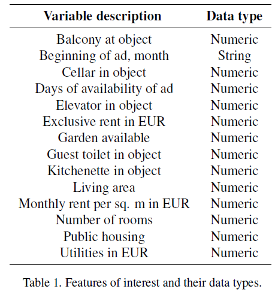

```{r setup, include=FALSE}
knitr::opts_chunk$set(echo = FALSE)

# Load dependencies 
library(reticulate) # For rendering Python code 
```

## Introduction

Machine learning’s most popular applications are definitely classification tasks. Perhaps you have heard about classifying handwritten digits or pictures of dogs and cats! However, it is also possible to use these models to predict the value of a variable of interest. To explore the possibilities that machine learning has to offer in the field of regression tasks, in this post we offer a primer in machine learning regressors. 

To illustrate this, we will walk you through the pipeline we implemented to train supervised regression algorithms from different families, make predictions with them and evaluate their performance from both, predictive and computational perspectives.

## The dataset

Step zero in any machine learning pipeline is definitely obtaining some good quality data. In our case, since our main objective was experimenting with machine learning algorithms, availability was the main selection criterion. Since we wanted to work with something very interpretable, familiar and relatable, we decided to look for datasets with information about the German apartment rental market. After considering using data hosted in Kaggle, we discovered a paper [@breidenbach2020real] documenting a vast, dataset curated by the FDZ Ruhr am RW: the RWI-GEO-RED dataset. While data from repositories like Kaggle can be very useful, there is nothing like scientific-grade datasets when it comes to experimentation.

After jumping a few administrative hoops and waiting a couple weeks -inescapable steps you should udget for in your dataset-searching endeavours- we received a dataset containing more than 400 thousand observations of 57 variables. Some preliminary exploration proved that we would have to spend a significant amount of time curating a our own version of the dataset. 

## Curation

Our preliminary exploration revealed some interesting codification for hard-coded missings, which were easy to relabel. This allowed us to determine that the most significant issue with many of the variables was the number of missing data they included. Since our focus was on experimenting with algorithms and not with imputation or data engineering, we decided to keep only those variables with a relatively low missings count and impute their value. While there are some very sophisticated imputing techniques, we went with imputing the mode for a variable containing the number of rooms and the mean for utility costs.

Other irrelevant (high level geographical information) or redundant variables (such as property type, which is uniform throughout the dataset) and metadata (like information quantifying ad metrics) were also dropped, leaving us with fifteen features to work with in our models. The features contained in our model are summarized in table 1.

```{r tab1, eval = TRUE, echo = FALSE, out.width = "45%", fig.align = 'center'}

```

The script we used in the curation process (curate.py) can be found in our repository.

## Preprocessing

With our set of features curated, we now readied the dataset to feed it to the models we intended to use. While some models are feature scale-invariant, so to speak, others will perform significantly better if the features take values on very similar scales. This is to say that, since the number of rooms in an appartment never -most definitely not in Berlin!- exceeds a few, the rent is usually in the hundreds or tens of hundreds: up to three orders of magnitude apart! Because of their inner workings, some models will give more importance to features of a larger magnitude. This problem comes also into play in algorithms that use gradient descent -like neural networs- and manifest in significantly larger training times.

With this in mind, we one-hot encoded the string variable adat, which contains information about the time of the year when the ad was published, the only categorical variable in the dataset. After exploring some options to encode this cyclical feature, we decided to one-hot encode it to focus our energy in the models. This is an improvement worth exploring in the future, as some information was definitely lost by doing this. 

We split the dataset into training and test sets, leaving 20% of the cases for the latter.

Most crucially, because of its impact on model performance both, predictive and computationally wise, we scaled the whole dataset using a standard min-max strategy, meaning all variables were forced into the [0, 1] range. We chose this strategy because we don’t know the distribution of the features and the RWI-GEO-RED dataset has been preprocessed to remove outliers; one of the advantages of scientific-grade datasets.

One should determine the scaling parameters using the training set only, and then apply it to the whole dataset: all learning -ingluding learning the right scaling parameters- should be done in the training set and the training set alone. One hot-encoded features should not be scaled. After trying to manually perform these transformations and failing, we decided to scale the dataset using the parameters of the whole dataset, instead of only the training set. This is something that should be avoided and we will preserve in future iterations of this exercise.

Scaling is perhaps one of the most impactful steps in the preprocessing stage of the pipeline. Our previous experiments with a multi-layer perceptron regressor yielded not only prohibitive training times but also dangerous processor temperatures (see figure 3). As is shown in the figure, the processors cooling mechanism (fan) was activated. This is far from being only anecdotal. According to Intel, the manufacturer of the CPU used to run our models, the temperature monitored is very similar to the measurement corresponding to the junction temperature of the processor, which has a chip-specific maximum operating value. At this temperature, the physical integrity of the unit is at risk, hence triggering a protection mechanism that will attempt to forcibly cool down the processor, in this case the computer’s fan.


```{r temp, eval = TRUE, echo = FALSE, fig.width = 5, fig.cap = "Fan temperature", fig.align = 'center'}

```

Finally, we proceeded to prepare the predictor vector X and the labels list y. With these tasks completed, we were now ready to explore the vast selection of models that are able to solve regression tasks. The script we used to preprocess our data preprocess.py is also available in our repository.

## The regressors

A good baseline for our experiment is an ordinary least squares linear regression, which has a closed-form solution -meaning its parameters can be calculated without any iterative optimization- and is the workhorse of the regression paradigm. Since the target variable hits is a counter, a natural first experiment was a Poisson regressor. This model is, in short, a generalized linear model with a Poisson distribution that uses the ‘log’ link function and is a natural strategy to regress a variable that takes only integer values.

In order to explore the possibilities offered by a different algorithmic paradigm, we next chose to use a regression tree. This model belongs to the family known as decision trees, non-parametric algorithms that learn by simple decision rules inferred from the data features. To further our exploration of this paradigm, we also trained a random forest regressor, which in simple terms is an ensemble of regression trees.

We decided to also build a support vector machine model, which can be said to belong to a different algorithmic family. When SVM is used for a regression task, the goal is to fit as many observations within the area between the support vectors and the decision boundary. In other words, the algorithm tries to choose the margin lines to cover as many data points as possible. For that purpose, users can choose the hyperparameter 𝜖 to control the width of the margin, effectively determining how much margin violation is allowed (Géron 2017). Allowing higher margin violation can be reasonable in case there are large outliers within the sample.

The only model that included more important hyper-parameter tuning was the multi-layer perceptron. For this task we decided to go for a the simplest architecture possible: a single hidden layer with a single hidden unit. We consider this strategy to be a good introduction to the world of neural networks. Comparing its performance will allow us to gain a first idea of its strengths and weaknesses.

Finally, in order to explore the possibilities offered by strategies that ensemble models belonging to different families, we decided to include a so-called voting regressor. This meta-model offers a best of n-worlds approach by averaging the predictions of the models we use in it. Best results are achieved by combining models from different families that perform similarly. We decided to to ensemble our baseline model with the forest, support and perceptron models.

Note that all models have been run with default options. This includes default maximum iterations, which can cause non convergence but still produces a valid result for our purposes.

The script for our model-fitting process (models.py is also available in our repository. Note that all models have been run with default options. This includes default maximum iterations, which can cause non convergence but still produces a valid result for our purposes.

## Evaluation metrics

In order to assess the performance of the models we experimented with, we chose the root mean squared error (RMSE) as a metric to assess the quality of their predictions. The metric is widely used to evaluate regression models and can be interpreted as a comparison between the predicted and actual test label that has the its same units. We chose this metric because of its suitability for regression tasks, its superior interpretability in comparison to the mean squared error and the fact that the RWI-GEO-RED dataset has undergone an outlier removal process, which we consider important given the metric’s sensitivity to them.

Moreover, we also wanted to assess the computational performance of our models. We decided to clock the runtimes of their training processes. While we were aware that this kind of measure is hardware-specific, we also noticed that the same task could have different runtimes on the same hardware. In order to confirm this, we clocked the runtimes of a sample of 100 runs of our baseline model. Our results are summarized in figure 3, which shows the distribution of model runtimes for the fitting process of our baseline model.

```{r fig3, eval = TRUE, echo = FALSE, fig.width = 5, fig.cap = "Runtime density", fig.align = 'center'}

```

As the plot shows, the runtimes exhibit an approximately Gaussian shape. We obtained a mean of 1.3078 seconds and a standard deviation of 0.0518 seconds. This shows that our implementation is not very stable and our measurements should be taken as illustrative of the typical runtimes the models can take rather than an absolute point-estimate. These caveat notwithstanding, the measurements we obtained are still indicative of -at least- the order of magnitude of our the computing time required to run the processes.

The script we used to sample the runtime distribution for the linear regressor (timing.py) is also available in our repository.

## Results 

We used the aforementioned metrics to gauge the performance of our models. Before going into a discussion of our results, we would like to point at the results we obtained with a test run without variable scaling, show in Table 2. While the RMSE values have changed significantly due to variable scaling, notice the abysmal difference in the runtimes achieved by the perceptron model. Feature scaling has reduced the training time from a prohibitive 6,000 seconds to a mere 36.

```{r tab2, eval = TRUE, echo = FALSE, out.width = '50%', fig.align = 'center'}
knitr::include_graphics("figures/table2.png")
```

Having discussed this preliminary run, let’s now discuss our actual results. Table 3 summarizes our metrics. The baseline model achieved an RMSE that is only surpassed by -leaving out the ensemble of three models out, as it is an “unfair” comparison- the random forest regressor. While the latter’s performance is 11% better, it comes at a huge runtime “overprice” of almost 40,000%. From the runtime perspective, the Poisson model achieves a slightly worse result than our baseline but does so in less than half the runtime. This must be related to the fact that this regressor deals with integer values specifically, a fact that must reduce the size of the memory buffers it needs to be fit, if we must venture an hypothesis. In this sense, this algorithm is particularly naturally oriented to the task we are trying to solve.

```{r tab3, eval = TRUE, echo = FALSE, out.width = '50%', fig.align = 'center'}

```

Our neural network algorithm, the simplest multi-layer perceptron possible -only one hidden layer and one hidden unit- performs just our baseline model but takes nearly thirty times longer to fit. The support vector regressor achieves an unimpressive result, specially in light of it lengthy fitting runtime.

The ensemble regressor, which -as discussed- averages the predictions of the algorithms involved, achieved the second best performance, beating the baseline by 6%. This interesting but not so cost-effective result -it needed more than 15 minutes to be trained- might be related to the fact that the strategies it combined -linear, forest, support and perceptron- penalize the best-achieving random forest regression.

In order to visualize the space configured by the two metrics we have studied, we created figure 3. The figure shows a scatter plot that combines the RMSE of each model in the X-axis with each algorithm’s runtime, measured in seconds.

```{r fig4, eval = TRUE, echo = FALSE, fig.width = 5, fig.cap = "Runtime density", fig.align = 'center'}
knitr::include_graphics("figures/figure4.png")
```

As we can see, no algorithm clearly provides the best of two worlds. On the contrary, we see that -for example- the random tree has -as expected because of its computational simplicity- one of the lowest runtimes but the worst RMSE. Conversely, we clearly confirm that the ensemble offers one of the best performing options but at a steep runtime cost. In figure 3, the best of two worlds seems to be offered by -ironically- the linear model, which offers the second best runtime and a performance that s only beat at great computational cost.

With these results in mind, we now proceed to discuss the conclusions we have drawn.

## Conclusions

In this primer we have walked you through a the implementation pipeline of a small but enlightening set of regression models and the tasks involved in obtaining, curating and preprocessing the the data involved.

As we have shown, obtaining dependable, high-quality data is an important and large portion of the workload. Starting with the administrative tasks, it is clear that obtaining, curating  and preprocessing a dataset for model-fitting is in fact one of the most time-consuming tasks of the data science pipeline.

One of the most important conclusions we can draw from this stage is that the importance of feature-scaling strategies can hardly be overstated for some models. The performance of our perceptron algorithm -both in terms of RMSE (compare its deviation in between tables 2 and 3) and runtime- improved drastically. The difference a few lines of code makes to this model's performance should be noted and taken advantage of in the future.

Including the runtime metric proved to be a success, as it opened the door to a new set of questions and model characteristics to be considered. From the theoretical point of view it brings questions like the one about better runtime metrics to the table. Other non-technical aspects of machine learning implementation also arise: model selection has an impact in resource consumption, which in turn impacts the environment and it stakeholders. Why our project may be considered a "toy" example for this purposes, the important conclusion is that in this -the ethical aspects of computation, let alone those of training set contents- could start playing a role.

Another important conclusion is the realization that a simple linear regression can still perform very well and at a low cost for tasks like the one we tackled in this project. It is clear from figure 2 that there are performance trade-offs in each family of models. This underscores the importance of understanding the area-specific requirements of the problems, because in some circumstances a small improvement in the error metric could warrant the runtime costs it entails. The converse may also be true, and it goes to show that it is also very important to become acquainted with the algorithm "menu" at hand to be able to pick the one that is best suited for our problem.

We hope that these conclusions can be helpful in the future to our readers and that this post has also left them with interesting questions and new exploration avenues.

## Acknowledgments 

We want to sincerely thank the Forschungsdatenzentrum Ruhr (FDZ), located at the RWI Essen, for providing access to the campus data set. Specifically, we want to thank Mrs. Yvonne Meyer who gave helpful advice on the data structure, provided all relevant documents and files and was the main contact person for us at the FDZ.